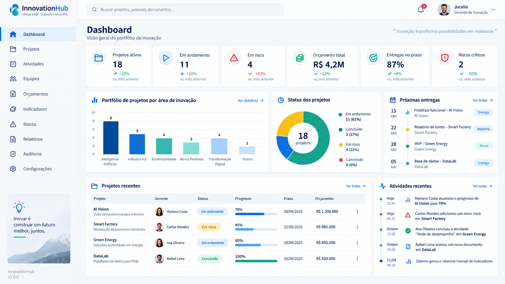
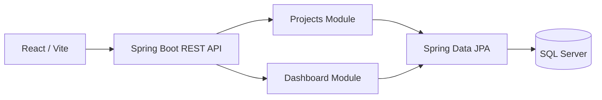

# InnovationHub — Gestão de Projetos de PD&I

Sistema corporativo para gestão de projetos de **Pesquisa, Desenvolvimento e Inovação (PD&I)**.

> Projeto de portfólio criado para demonstrar Java 21, Spring Boot, modelagem de domínio, APIs REST, SQL Server, testes, Docker e decisões arquiteturais de nível pleno.




> **Engineering decisions & trade-offs:** [docs/engineering-decisions.md](docs/engineering-decisions.md)
>
> **Quality hardening:** [docs/quality-hardening.md](docs/quality-hardening.md) — SQL Server real com Testcontainers, Flyway, optimistic locking e baseline de observabilidade. — contexto, alternativas consideradas, custos das escolhas, estratégia de testes e diagnóstico operacional.

## Technical Snapshot

| Focus | Evidence in this project |
|---|---|
| Target roles | Java Backend Developer · Backend Engineer · Software Engineer |
| Architecture | Modular Monolith · Layered Architecture · REST API |
| Backend | Java 21 · Spring Boot · Spring Web · Spring Data JPA · Hibernate |
| Data | Microsoft SQL Server · Flyway · JPA |
| API quality | DTOs · Bean Validation · ProblemDetail · Pagination · Optimistic Locking |
| Testing | JUnit 5 · Mockito · MockMvc · JaCoCo |
| Delivery | Docker · Docker Compose · GitHub Actions · OpenAPI |

**Engineering highlights:** escolha consciente de monólito modular para reduzir complexidade operacional, modelagem de domínio, tratamento padronizado de erros e controle de concorrência com `@Version`.

**Keywords:** `Java Backend` `Spring Boot` `REST API` `Modular Monolith` `SQL Server` `JPA` `Hibernate` `Flyway` `JUnit 5` `Docker` `OpenAPI`

---

## Objetivo

O InnovationHub centraliza projetos de inovação, responsáveis, status, orçamento e indicadores de portfólio. A primeira versão entrega o núcleo de **Projetos + Dashboard** e deixa a base pronta para os módulos de atividades, equipes, orçamento, riscos, indicadores, auditoria e IA.

## Arquitetura

A v0.1 usa **Modular Monolith** deliberadamente.



### Por que não microsserviços?

O domínio inicial ainda não justifica o custo operacional de múltiplos serviços. O monólito modular reduz complexidade de deploy e observabilidade sem abrir mão de limites claros entre módulos. Caso requisitos de escala, autonomia de equipes ou isolamento de dados apareçam, módulos podem ser extraídos posteriormente.

## Stack

### Backend
- Java 21
- Spring Boot 3.5.5
- Spring Web
- Spring Data JPA / Hibernate
- Bean Validation
- Flyway
- SQL Server
- Spring Boot Actuator
- JUnit 5 / Mockito / MockMvc
- JaCoCo

### Frontend
- React 19
- Vite
- CSS responsivo
- API REST

### Infraestrutura
- Docker / Docker Compose
- GitHub Actions
- Nginx

## Estrutura

```text
innovationhub/
├── backend/
│   └── src/main/java/com/innovationhub/
│       ├── dashboard/
│       ├── project/
│       └── shared/
├── frontend/
│   └── src/
├── docs/
│   ├── mockups/
│   └── superpowers/
├── docker-compose.yml
└── README.md
```

## Subir o projeto completo

Copie o arquivo de variáveis:

```powershell
Copy-Item .env.example .env
```

Depois:

```powershell
docker compose up --build
```

Acessos:

- Frontend: `http://localhost:3000`
- Backend: `http://localhost:8080`
- Health: `http://localhost:8080/actuator/health`
- Swagger: `http://localhost:8080/swagger-ui.html`
- SQL Server: `localhost:14333` (database `innovationhub` is created by the init container)

## Executar pelo IntelliJ

1. Suba apenas o banco:

```powershell
docker compose up -d sqlserver
```

2. Abra a pasta `backend` no IntelliJ.
3. Execute `InnovationHubApplication`.
4. Para o frontend:

```powershell
cd frontend
npm install
npm run dev
```

Frontend de desenvolvimento: `http://localhost:5173`.

## Endpoints v0.1

### Projetos

```http
POST /api/v1/projects
GET  /api/v1/projects?page=0&size=10&sort=createdAt,desc
GET  /api/v1/projects/{id}
```

Exemplo:

```json
{
  "name": "Smart Factory AI",
  "description": "Inspeção industrial utilizando visão computacional.",
  "startDate": "2026-10-01",
  "endDate": "2027-03-31",
  "budget": 850000.00,
  "managerName": "Jucelio Coelho"
}
```

### Dashboard

```http
GET /api/v1/dashboard/summary
```

## Regras implementadas

- Projeto nasce com status `DRAFT`.
- Código corporativo gerado automaticamente.
- Data final não pode ser anterior à data inicial.
- Orçamento não pode ser negativo.
- Entidades JPA não são expostas diretamente pela API.
- Paginação no endpoint de projetos.
- Tratamento global de erros com `ProblemDetail`.
- Controle de concorrência otimista com `@Version`.
- Migrações versionadas com Flyway.
- Seed de dados apenas no perfil `dev`.

## SQL Server Integration Testing

A suíte de qualidade valida o backend contra **Microsoft SQL Server real via Testcontainers**, incluindo migrations Flyway e conflito de concorrência com `@Version`.

```bash
cd backend
mvn clean verify
```

O Docker precisa estar disponível para os testes de integração.

Endpoints de observabilidade:

```text
/actuator/health
/actuator/info
/actuator/metrics
/actuator/prometheus
```

---

## Testes

No diretório `backend`:

```powershell
mvn test
mvn verify
```

O `verify` também gera relatório JaCoCo.

## Próximas versões

- **v0.2:** autenticação JWT + RBAC
- **v0.3:** atividades e equipes
- **v0.4:** orçamento e despesas
- **v0.5:** riscos e indicadores
- **v0.6:** auditoria de alterações
- **v0.7:** observabilidade com Prometheus/Grafana
- **v0.8:** módulo Innovation AI

## Argumento para entrevista

> “No NexaPay usei microsserviços e arquitetura orientada a eventos porque pagamentos distribuídos exigiam resiliência e desacoplamento. No InnovationHub optei por um monólito modular, pois o domínio inicial não justificava o custo operacional de microsserviços. Mantive limites de módulo para permitir evolução futura sem introduzir complexidade prematura.”

## Status

**InnovationHub v0.1.0 — Foundation / Projects + Dashboard**
