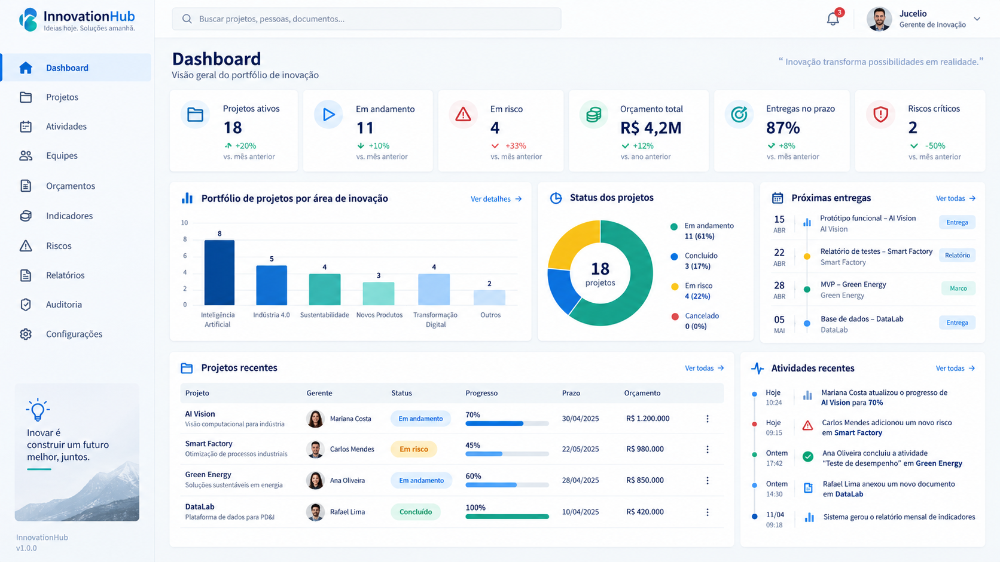
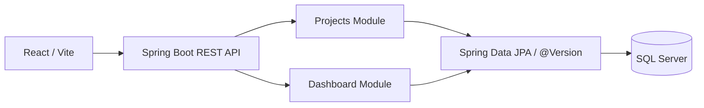

# InnovationHub — PD&I Project Governance Case

Sistema corporativo para gestão de projetos de **Pesquisa, Desenvolvimento e Inovação (PD&I)**, construído como um case de domínio, consistência transacional e decisão arquitetural consciente.

> **Problema central do case:** uma edição baseada em estado obsoleto não pode sobrescrever silenciosamente uma alteração mais recente do projeto.



**Business case:** [docs/business-case.md](docs/business-case.md)  
**Engineering decisions:** [docs/engineering-decisions.md](docs/engineering-decisions.md)  
**Quality hardening:** [docs/quality-hardening.md](docs/quality-hardening.md)  
**Interview case:** [docs/PORTFOLIO_CASE_STUDY.md](docs/PORTFOLIO_CASE_STUDY.md)

## Business Problem

Times de PD&I precisam centralizar projetos, responsáveis, períodos, orçamento, status e indicadores. Além de dados inválidos, existe um problema menos visível: **lost update**.

Dois gestores podem ler a mesma versão de um projeto, editar informações diferentes e tentar salvar. Sem controle de concorrência, a última gravação poderia apagar silenciosamente uma alteração já confirmada.

## Critical Business Rule — no silent lost update

O InnovationHub torna a versão esperada explícita no contrato de atualização:

```text
GET /api/v1/projects/10
-> version 5

Gestor A
PUT /api/v1/projects/10 + version 5
-> 200 OK
-> version 6

Gestor B ainda usa version 5
PUT /api/v1/projects/10 + version 5
-> 409 Conflict
-> versão 6 permanece autoritativa
```

A proteção ocorre em duas camadas:

1. **Application stale check:** se `request.version` já difere da versão atual, o update é rejeitado antes de mutar o projeto.
2. **JPA `@Version` + SQL Server:** se duas transações carregarem a mesma versão antes do primeiro commit, o banco/JPA arbitram a corrida no `flush()`.

O resultado HTTP é estável nos dois casos: `409 Conflict` com `ProblemDetail`, sem expor detalhes de Hibernate/SQL.

## Why a Modular Monolith

A arquitetura v0.1 é deliberadamente um **Modular Monolith**.

O domínio atual não exige deploy independente, escala desigual por módulo, comunicação remota ou ownership por múltiplas equipes. Introduzir microservices agora acrescentaria rede, operação e observabilidade distribuída sem proteger melhor as regras existentes.


```mermaid
flowchart LR
    UI[React / Vite] --> API[Spring Boot REST API]
    API --> P[Projects Module]
    API --> D[Dashboard Module]
    P --> JPA[Spring Data JPA / @Version]
    D --> JPA
    JPA --> DB[(SQL Server)]
```

A extração futura de módulos só deve ocorrer se escala, autonomia, isolamento de falha/dados ou ciclos de release justificarem o custo.

## Evidence

O projeto não apresenta optimistic locking apenas como annotation. A regra é verificável em diferentes fronteiras:

- `ProjectServiceTest` — stale version, regras e mutação controlada;
- `ProjectControllerTest` — `PUT`, Bean Validation, `404`, `422` e `409 ProblemDetail`;
- `ProjectUpdateApiIntegrationTest` — update real e stale update via HTTP contra SQL Server/Testcontainers;
- `ProjectOptimisticLockingIntegrationTest` — corrida real entre dois persistence contexts;
- `SqlServerPersistenceIntegrationTest` — Flyway/JPA contra SQL Server real;
- GitHub Actions — `mvn verify`, frontend e validação de observabilidade.

## Main Business Rules

- Projeto nasce com status `DRAFT`.
- Código corporativo é gerado pelo sistema.
- Data final não pode ser anterior à inicial.
- Orçamento não pode ser negativo.
- Atualização baseada em versão obsoleta não pode sobrescrever estado recente.
- Entidades JPA não são expostas diretamente pela API.
- Flyway é a autoridade do schema.
- Dashboard expõe leitura agregada do portfólio.

## API v0.1

### Projects

```http
POST /api/v1/projects
PUT  /api/v1/projects/{id}
GET  /api/v1/projects?page=0&size=10&sort=createdAt,desc
GET  /api/v1/projects/{id}
```

Exemplo de criação:

```json
{
  "name": "Smart Factory AI",
  "description": "Inspeção industrial utilizando visão computacional.",
  "innovationArea": "ARTIFICIAL_INTELLIGENCE",
  "startDate": "2026-10-01",
  "endDate": "2027-03-31",
  "budget": 850000.00,
  "managerName": "Jucelio Coelho"
}
```

Exemplo de atualização completa:

```json
{
  "version": 5,
  "name": "Smart Factory AI",
  "description": "Inspeção industrial com visão computacional.",
  "innovationArea": "ARTIFICIAL_INTELLIGENCE",
  "startDate": "2026-10-01",
  "endDate": "2027-03-31",
  "budget": 900000.00,
  "managerName": "Jucelio Coelho"
}
```

Resultados relevantes:
- `200 OK` — update confirmado e nova `version` devolvida;
- `400 Bad Request` — validação de campos;
- `404 Not Found` — projeto inexistente;
- `409 Conflict` — versão obsoleta / optimistic locking;
- `422 Unprocessable Entity` — regra de domínio, como período inválido.

### Dashboard

```http
GET /api/v1/dashboard/summary
```

## Technical Snapshot

| Focus | Evidence in this project |
|---|---|
| Architecture | Modular Monolith · Layered/Module boundaries · REST API |
| Backend | Java 21 · Spring Boot 3.5.5 · Spring Web · Spring Data JPA/Hibernate |
| Data | Microsoft SQL Server · Flyway · JPA `@Version` |
| API quality | DTOs · Bean Validation · ProblemDetail · Pagination |
| Testing | JUnit 5 · Mockito · MockMvc · Testcontainers · JaCoCo |
| Observability | Actuator · Micrometer · Prometheus · Grafana |
| Delivery | Docker · Docker Compose · GitHub Actions · OpenAPI |
| Frontend | React 19 · Vite |

## Project Structure

```text
innovationhub/
├── backend/
│   └── src/main/java/com/innovationhub/
│       ├── dashboard/
│       ├── project/
│       └── shared/
├── frontend/
│   └── src/
├── docs/
│   ├── mockups/
│   ├── superpowers/
│   ├── business-case.md
│   ├── engineering-decisions.md
│   ├── quality-hardening.md
│   └── PORTFOLIO_CASE_STUDY.md
├── docker-compose.yml
└── README.md
```

## Run with Docker Compose

Crie o arquivo local de variáveis:

```powershell
Copy-Item .env.example .env
```

Suba o ambiente:

```powershell
docker compose up --build
```

Acessos:
- Frontend: `http://localhost:3000`
- Backend: `http://localhost:8080`
- Health: `http://localhost:8080/actuator/health`
- Swagger: `http://localhost:8080/swagger-ui.html`
- SQL Server: `localhost:14333`
- Prometheus: `http://localhost:9090`
- Grafana: `http://localhost:3001`

## Run for Development

Banco:

```powershell
docker compose up -d sqlserver
```

Backend: abra `backend` no IntelliJ e execute `InnovationHubApplication`.

Frontend:

```powershell
cd frontend
npm install
npm run dev
```

Frontend de desenvolvimento: `http://localhost:5173`.

## Tests

```bash
cd backend
mvn clean verify
```

Docker precisa estar disponível para os testes SQL Server/Testcontainers. O `verify` também gera relatório JaCoCo.

## Observability Baseline

```text
/actuator/health
/actuator/info
/actuator/metrics
/actuator/prometheus
```

O Grafana provisiona `InnovationHub / InnovationHub Backend Overview`, com painéis HTTP e JVM/processo. Essa instrumentação é uma baseline diagnóstica; o projeto **não reivindica SLOs, throughput, latência ou disponibilidade de produção** sem medições representativas.

## Roadmap

- **v0.2:** autenticação JWT + RBAC
- **v0.3:** atividades e equipes
- **v0.4:** orçamento e despesas
- **v0.5:** riscos e indicadores
- **v0.6:** auditoria de alterações
- **v0.7:** logs estruturados/tracing se a necessidade operacional justificar
- **v0.8:** módulo Innovation AI

Roadmap não representa capacidade já entregue.

## Interview Positioning

> “No InnovationHub, mantive um monólito modular porque o domínio atual não justificava microsserviços. Um risco importante era lost update: dois gestores podem editar a mesma versão do projeto. Então tornei a version explícita no PUT, rejeito stale requests com 409 e mantenho JPA `@Version` + SQL Server como proteção final de corrida. O comportamento é comprovado com MockMvc e Testcontainers contra o banco real.”

## Status

**InnovationHub v0.1.0 — Projects + Dashboard + Versioned Project Update**
